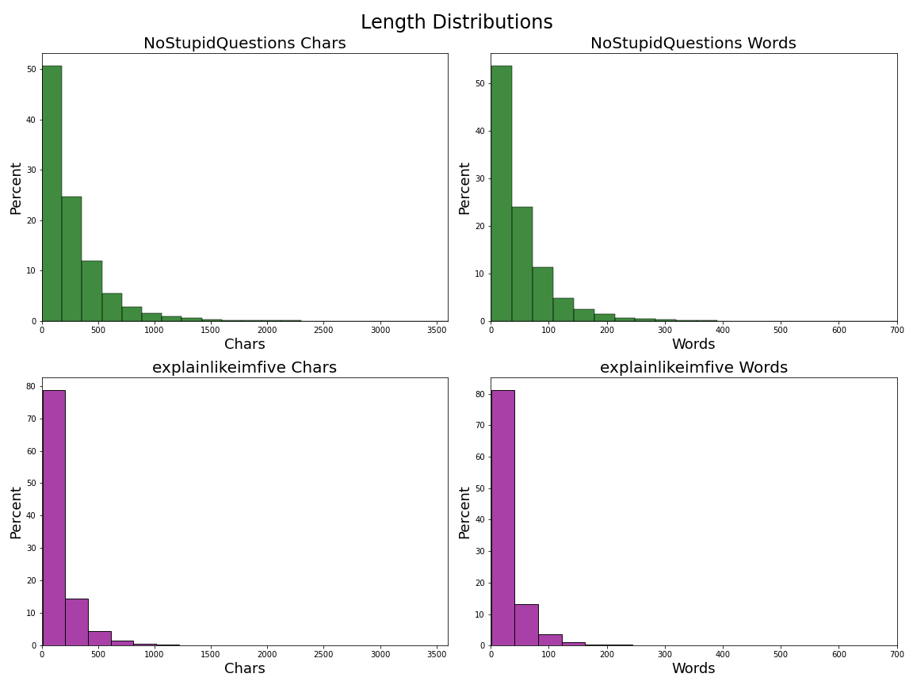
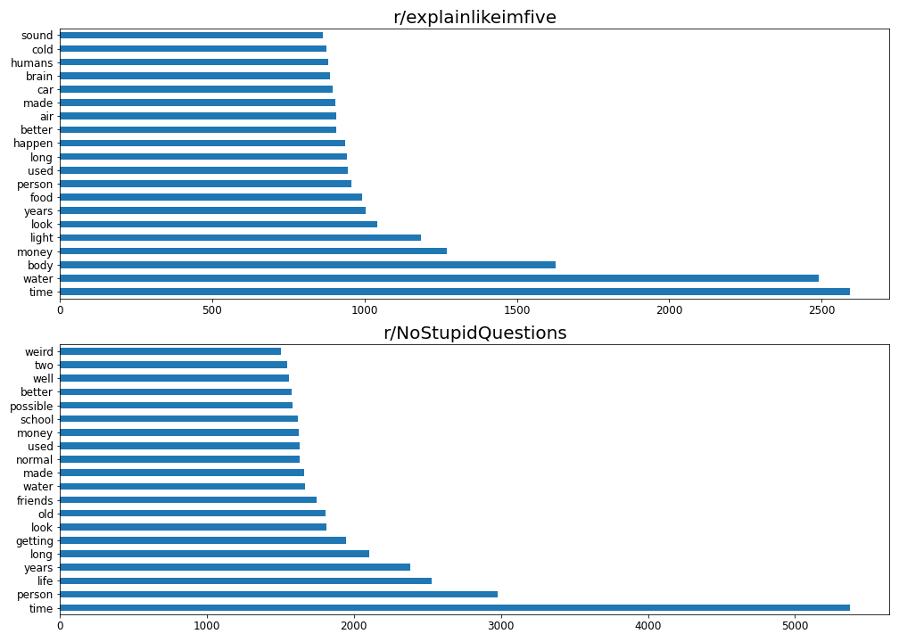
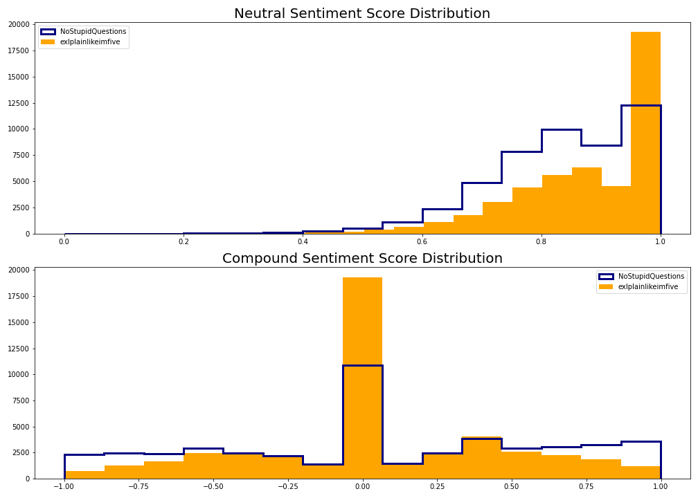
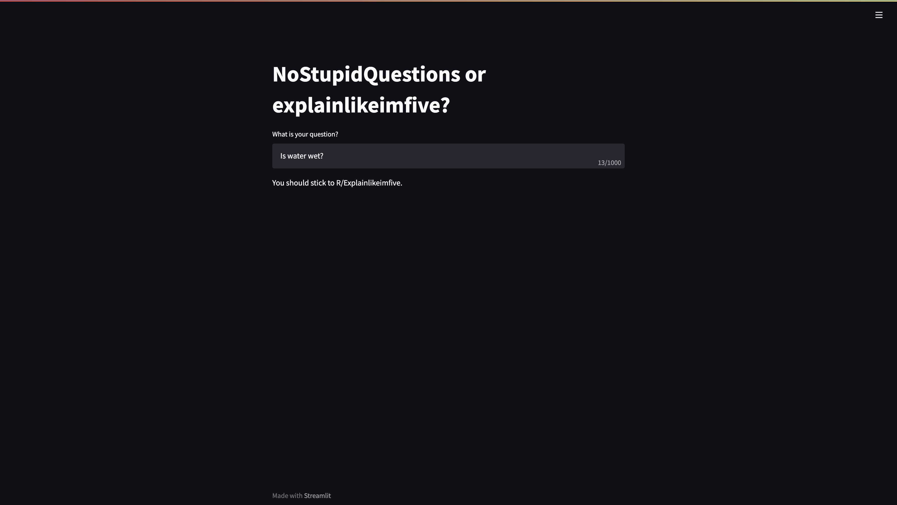

# **Subreddit Classification**

## Problem Statement

Misinformation on the internet is found just about
everywhere. This project seeks to explore two prominent
informational subreddits to determine general bias
toward types of questions. Then we will build a model
that can help determine which one is better suited to an
individual’s question.

## Background

According to a study done by the Pew Research Center in 2016, “4% of U.S. adults report using the site…70% of Reddit users say they get news there.” That means that a large slice of all Reddit users trusts the information on these mostly unregrulated forums. In a more recent 2021 study PEW found that, “Reddit was the only other platform polled about that experienced statistically significant growth during
this time period – increasing from 11% in 2019 to 18% today.” We can infer therefore that an even more relevant portion of the US population today uses Reddits information for educational purposes. 

We are going to examine two informational subreddits: r/NoStupidQuestions, which has 2.5m members and was created on Feb 2, 2013 and r/explainlikeimfive which has 20.0m members and was created Jul 28, 2011.

### Data

* [`text_base.csv`](./data/text_base.csv): Our final and primary data frame after all cleaning. Has sentiment scores and combined text.
* [`cleaned.csv`](./datasets/cleaned.csv): An early mostly cleaned iteration of text_base
* [`submissions_50k.csv`](./datasets/submissions_50k.csv): The raw version of our final dataset
* [`submissions_25k.csv`](./datasets/submissions_25k.csv): Smaller unused dataset at 25k rows per subreddit
* [`submissions_12k.csv`](./datasets/submissions_12k.csv): Smaller unused dataset at 12k rows per subreddit
* [`submissions_5k.csv`](./datasets/submissions_5k.csv): Smaller unused dataset at 5k rows per subreddit

### Folder Layout

In this repository you'll find three folders: 'data,' 'imgs,' and 'models.' In this current folder you'll also find the pdf for my presentation, a .py file containing a Streamlit application proof-of-concept I built, and all the codework. The codework consists of 3 files: 'SW-start.ipynb' contains the gathering data steps, 'SW-cleaning.ipynb' contains data cleaning and EDA, and 'SW-modeling.ipynb' contains all modeling. 

In the 'data' folder you'll find all csv's including several unused and raw original csv's that contained smaller datasets. 

There is the 'imgs' folder which just contains the png's of images used here and in the presentation.

Finally, the 'models' folder contains pickled versions of all the final models I created after GridSearching and BayesSearching.

### Data Dictionary

The following only contains features for final dataset, the only one used for modeling.

| Feature          | Type   | Dataset         | Description                                                                                                                                                   |
|------------------|--------|-----------------|---------------------------------------------------------------------------------------------------------------------------------------------------------------|
| text      | object | text_base  | The title and selftext of each Reddit post                                                                                                         |
| subreddit         | object  | text_base  | Which subreddit post belongs to                                                                                                     |
| neg       | float  | text_base  | The Negative value of the sentiment score of text                                                                                   |
| neu              | float  | text_base | The Neutral value of the sentiment score of text                                                            |
| pos           | float | text_base        | The Positive value of the sentiment score of text                                                                      |
| compound   | float  | text_base        | The Compound value of the sentiment score of text                                                                         |

## Executive Summary

In this project we seek to explore the unseen differences in two subreddits: "NoStupidQuestions" and "explainlikeimfive" which both present as informational forums that people can use to have their questions answered. From here on I will refer to the subreddits as: Explain and Stupid.

First we had to use Reddit's API to pull Reddit posts or comments. We chose to use posts as they are more relevant to potential question askers in the future which is what our focus is. After taking care of NaNs and getting our data into an easily digestible form our first step in comparing these two features was to create new columns for word length and character length for comparison.

As we can see the word counts and character counts of the Stupid subreddit were significantly longer than that of Explain. This didn't necessarily indicate any bias at this point but was an interesting distinction. In fact of all the Posts over 500 words in length Stupid had 71 while Explain only had 3. Explain is clearly a shorter form of question. Whether that is because it is more succinct and professional, or lesst detailed remained to be seen.

Next we checked the top 20 words after building in a custom set of stopwords.

Both pages share many of the same words, the most prevalent shown here to be "time." On the other hand, it appears that Explain has more objective words like sound, cold, brain, and human. These have no emotional conotation and probably less indication of bias as they appear more scientific in nature.

Stupid on the other hand had words more indicative of personal lives and emotional subjectivity like weird, normal, friends, and person. It also included school which may indicate a younger crowd.

These qualities were further confirmed by a random drawing of a quote containing the word "time" from both subreddits. They are as follows:

“How does time dilation work?” -explainlikeimfive
“Why is oversharing a red flag? I overshare all the time. Oops.” -NoStupidquestions

One is a physics problem, short and to the point, the other revolves around personal narrative and has a sense of humor.

To dig deeper into the subjectivity versus objectivity of these thread we conducted a Sentiment Analysis to reveal emotional impact.

Very clearly we can see that explainlikeimfive is far more neutral and has less tendency to spike at the extremes of positive and negative while NoStupidQuestions shows the opposite, a tendency to spike closer to 1 and -1 with a lower neutrality score. This confirms, to some extent, what we were noticing in word counts with time and length in that although both of these forums are billed as informational, they act in two differnt ways which could lead to confusion and misinforming a potential new poster.

After this we conducted several predictive models to see if we could determine based on the text, which subreddit it should be a part of.

| Model                        | Training Score              | Testing Score               | Recall             | Precision          | F1                 |
|------------------------------|-----------------------------|-----------------------------|--------------------|--------------------|--------------------|
|       CVec/RandomForest      |      0.7082044505841016     |      0.7067932592929965     | 0.7601375052616809 | 0.686411149825784  | 0.7213955191584274 |
| TfidfVect/RandomForest       | 0.7123036727829665          | 0.7113477910520969          | 0.7590851690753473 | 0.69248            | 0.7242544931222598 |
| CVec/Multinomial Naive Bayes | 0.7520646265653623          | 0.7402515502925411          | 0.7973902062578925 | 0.7152026176692675 | 0.7540635573542094 |
| CVec/Logistic Regression     | 0.8200096098981952          | 0.797638650457205           | 0.8189280202048548 | 0.7851089588377724 | 0.801661973765538  |
| Tfidf/Logistic Regression    | 0.820039640830055           | 0.8001961952142381          | 0.7985828539357374 | 0.8007738304607809 | 0.7996768414766939 |
| BASE                         | NoStupidQuestions: 0.502055 | explainlikeimfive: 0.497945 |                    |                    |                    |

As we can see the Tfidf Logistic Regression out performec the others and was fairly evenly balanced. We also outperformed the base model which as at about 0.50.

## Conclusions and Recommendations

With Reddit such a prominent source of news for a chunk of the US adult population, we set out to determine if two informational subreddits were both equally good at providing information or if there were distinct differences. This is important because as users and readers and commenters understand the tendencies of the forum they're are reading, it provides them a lens through which to view information and contextualize it's value for their intended purpose. For example, if you were interested in finding out an scientific fact, you would want to know that you would probably get a better answer and be in the company of more serious questions if you posted in "explainlikeimfive" rather than the more emotionally bias "NoStupidQuestions." Misinformation can cause a lot of harm and with internet regularization such a difficult prospect, context is everything.

With our analysis we were able to build a model that can analyze a quesion and determine between these two subreddits which is the better fit for the type of question you want to ask. This information alone offers some minor protection to both you the questioner as well as all future people visiting the page.

We thought a good potential use for this could be an integration with Reddit so we built a functional albeit unpolished proof-of-concept Streamlit app that would determine with about 80% accuracy which subreddit text belongs to.

This app simply returns the better subreddit based on your question. One way Reddit oculd deploy this is to use it as a gatekeeper for all new questions. It feeds your question into it and asks for confirmation that this is the appropriate page to post this question, potentially offering a better suited page.

When continuing work on this project here are a few things that can be impoved.

1. Test more parameters and model variations. Due to time and hardware constraints at the time of this making the level of depth we would have preferred was not possible.
2. Analyze comments in addition to original poster's text. This will give insight onto the types of answers these questions receive further indication classification.
3. Include other features in actual modelling process.

## Citations

- Auxier, Brooke, and Monica Anderson. “Social Media Use in 2021.” Pew Research Center: Internet, Science &amp; Tech, Pew Research Center, 9 Apr. 2021, https://www.pewresearch.org/internet/2021/04/07/social-media-use-in-2021/. 

- Barthel, Michael, et al. “Seven-in-Ten Reddit Users Get News on the Site.” Pew Research Center's Journalism Project, Pew Research Center, 27 Aug. 2020, https://www.pewresearch.org/journalism/2016/02/25/seven-in-ten-reddit-users-get-news-on-the-site/. 
